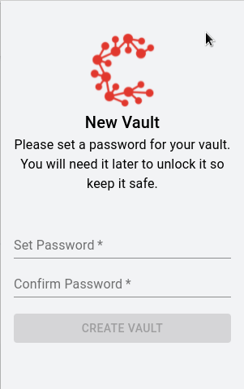
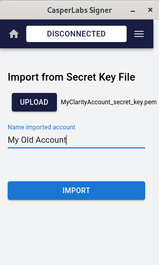

# Signer Guide

CasperLabs Signer acts as your CSPR wallet, keeping your accounts and letting you sign deploys on the Casper Network to perform actions like staking, unstaking or sending your tokens to another person or an exchange account.

You can create, store and use one or more CSPR accounts on your Signer wallet. All accounts are stored safely in a vault, which is protected by a password you will set when you create it.

## New User (No Accounts)

### Download Signer

Using Chrome or a Chromium-based browser like Brave, visit the Chrome Web Store, then download and install the [CasperLabs Signer extension](https://chrome.google.com/webstore/detail/casperlabs-signer/djhndpllfiibmcdbnmaaahkhchcoijce).

### Set Up Signer

Signer let's you sign deploys on the Casper Network. To get started, you'll need to create a Vault.

1. Create a password for your new vault. Vaults are used to store your Signer accounts. Confirm the Vault password, and then click `Create Vault` . *Make sure to write down and store your password in a secure location.*

    

2. Next, create your first account by clicking `Create Account`.

    

3. Name your new account

    

4. Select an Algorithm using the dropdown. (Select `ED25519` if you are not sure. See the FAQ for details.) Then click `Create` to create the account.

## New User (Has Secret Keys)

If you already have your secret keys and would like to set up and use your wallet with your existing accounts, follow the steps below. These steps also apply for the users migrating from the now-outdated Clarity to [CSPR.Live](https://cspr.live).

### Download Signer

Using Chrome or a Chromium-based browser like Brave, visit the Chrome Web Store, then download and install the [CasperLabs Signer extension](https://chrome.google.com/webstore/detail/casperlabs-signer/djhndpllfiibmcdbnmaaahkhchcoijce).

### Set Up Signer

Signer let's you sign deploys on the Casper Network. To get started, you'll need to create a Vault.

1. Create a password for your new vault. Vaults are used to store your Signer accounts. Confirm the Vault password, and then click `Create Vault` . *Make sure to write down and store your password in a secure location.*

    

2. Next, import your existing account by clicking `IMPORT ACCOUNT`.

    

3. Click on the `UPLOAD` button and select your secret key file (with a `.pem` extension), and give a name to your account. Then click on the `IMPORT` button to complete the import operation.

    

4. Repeat the same steps for all accounts you would like to import to your new wallet.

## Returning User (Has Accounts)

Open the Signer extension and log into your Vault. Click on the hamburger menu icon to select from a range of capabilities. Notice that ✔️ indicates the active account:

### Key Management

See all accounts within the vault. From here you can edit the account, delete the account, and view and download your keys.

### Connected Sites

View websites and DApps that your accounts have connected with (e.g. [CSPR.Live](https://cspr.live))

### Download Active Key

Downloads the public and private keys for the active account. You can change active accounts by clicking on any account name in the hamburger menu. 

### Lock

Immediately bars access to the vault. The user is able to unlock the vault at any time by providing the vault password.

## What's Next?

Once you have a Signer account you can [connect it to CSPR.Live](Connect-a-Wallet.md) to access a range of capabilities, like viewing your account balance, and [delegating CSPR stake](Delegating-CSPR-Stake.md) for rewards.
