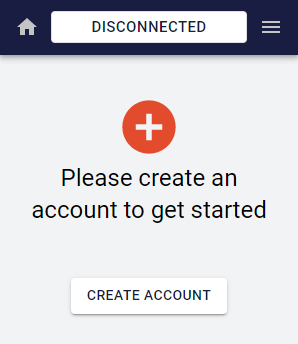
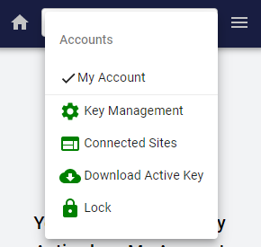

# Signer Guide

## New User (No Accounts)

### Download Signer

Using Chrome or a Chromium-based browser like Brave, visit the Chrome Web Store, then download and install the [Casper Labs Signer extension](https://chrome.google.com/webstore/detail/casperlabs-signer/djhndpllfiibmcdbnmaaahkhchcoijce).

### Set Up Signer

Signer let's you sign deploys on the Casper network. To get started, you'll need to create a Vault.

1. Create a password for your new vault. Vaults are used to store your Signer accounts. Confirm the Vault password, and then click `Create Vault` . *Make sure to write down and store your password in a secure location.*
2. Next, create your first account by clicking `Create Account`.

    

3. Name your new account

    

4. Select an Algorithm using the dropdown. Then click `Create` to create the account.

## Returning User (Has Accounts)

Open the Signer extension and log into your Vault. Click on the hamburger menu icon to select from a range of capabilities. Notice that ✔️ indicates the active account:

### Key Management

See all accounts within the vault. From here you can edit the account, delete the account, and view and download your keys.

### Connected Sites

View websites and DApps that your accounts have connected with (e.g. [CSPR.Live](http://cspr.live))

### Download Active Key

Downloads the public and private keys for the active account. You can change active accounts by clicking on any account name in the hamburger menu. 

### Lock

Immediately bars access to the vault. The user is able to unlock the vault at any time by providing the vault password.

## What's Next?

Once you have a Signer account you can [connect it to CSPR.Live](Connect-a-Wallet.md) to access a range of capabilities, like viewing your account balance, and [delegating CSPR stake](Delegating-CSPR-Stake.md) for rewards.
