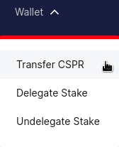

# Transfer CSPR

You can transfer CSPR tokens from your account to other accounts and exchanges by following this guide.

## What You'll Need

A compatible wallet with a CSPR balance: [Casper Signer](https://chrome.google.com/webstore/detail/casperlabs-signer/djhndpllfiibmcdbnmaaahkhchcoijce). More wallets, including Ledger, are planned for the future.

## The Basics

### Connect a Wallet

You can access the wallet Sign In screen by clicking `Sign In` from the top navigation menu of [CSPR.Live](https://cspr.live). Then follow these steps to sign in using the Signer app:

1. From the Sign In screen, click `Sign In` under the Casper Signer option.

    

2. The Signer app window will open automatically. From the Signer window, when prompted to connect Signer to site, click `Connect`.

    

3. Then click `Connect` again to approve the connection.

    

### Access Transfer CSPR Wizard

Once you've signed in, you can access the Transfer CSPR wizard by clicking `Wallet` from the top navigation menu, then clicking `Transfer CSPR`.

## Transfer CSPR

### Step 1 - Transfer Details

1. Start by entering the address (Public Key) of the recipient into the Recipient box.
2. Next, enter the Amount of CSPR you would like to send.
3. Then adjust the Transfer ID (Memo) if needed. (This is only needed when sending tokens to some exchanges. Check it on the recipient exchange account, and make sure you have entered the correct value if needed.)
3. Click `Next`.

### Step 2 - Confirm Transfer

1. Review the details of the transfer.
2. If everything appears correct, click `Confirm and transfer`. If there is something you wish to change, you can return to the previous step by clicking `Back to Step 1`.

### Step 3 - Sign

1. Click `Sign with Casper Signer`.
2. Signer app window opens. Make sure that the Deploy hash in the Signer window matches the Deploy hash in [CSPR.Live](https://cspr.Live) before continuing.
3. Click `Sign` in the Signer window to sign and finalize the transaction.

### Step 4 - Done

The CSPR transfer initiates as soon as the deploy is signed. You can review the details and status of the deploy by clicking `Deploy Details`. (It may take 1-2 minutes for the deploy details to become available.) 

