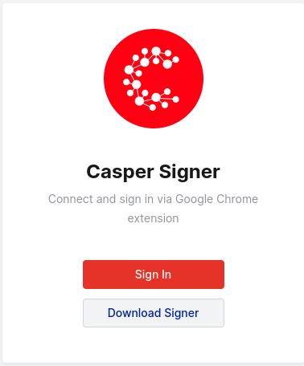
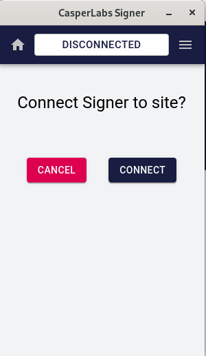
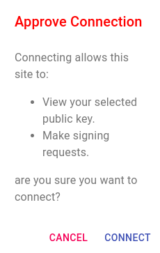

# Undelegating CSPR Stake

## What You'll Need

A compatible wallet with a balance of at least 2.5 CSPR: [Casper Signer](https://chrome.google.com/webstore/detail/casperlabs-signer/djhndpllfiibmcdbnmaaahkhchcoijce). More wallets, including Ledger, are planned for the future.

## The Basics

### Connect a Wallet

You can access the wallet Sign In screen by clicking `Sign In` from the top navigation menu of [CSPR.Live](https://cspr.live). Then follow these steps to sign in using the Signer app:

1. From the Sign In screen, click `Sign In` under the Casper Signer option.

    

2. The Signer app window will open automatically. From the Signer window, when prompted to connect Signer to site, click `Connect`.

    

3. Then click `Connect` again to approve the connection.

    

### Access Undelegate Stake Wizard

Once you've signed in, you can access the Undelegate Stake wizard in a few ways. 

* **OPTION 1:** Click `Wallet` from the top navigation menu, then click `Undelegate Stake`

* **OPTION 2:** Go to your account details by clicking your Public Key in the top navigation menu, or by clicking `View Account` from the expanded menu. Then click on the `Delegations` tab, and click on the `Undelegate` button next to entry you would like to undelegate.

* **OPTION 3:** Click `Validators` from the top navigation menu. From the Validators table, click on any Validator you have staked with to access their details. Click the `Undelegate Stake` button.

## Undelegate Stake

### Step 1 - Undelegation Details

1. Start by choosing which Validator you would like to undelegate stake from. If a Validator is not already selected, you can search for one using the Validator search box. It will automatically show the validators you have staked with.
2. Next, enter the Amount of CSPR you would like to undelegate.
3. Click `Next`.

### Step 2 - Confirm Details

1. Review the details of the transaction.
2. If everything appears correct, click `Confirm and undelegate stake`. If there is something you wish to change, you can return to the previous step by clicking `Back to Step 1`.

### Step 3 - Sign

1. Click `Sign with Casper Signer`.
2. Signer app window opens. Make sure that the Deploy hash in the Signer window matches the Deploy hash in [CSPR.Live](https://cspr.Live) before continuing.
3. Click `Sign` in the Signer window to sign and finalize the transaction.

### Step 4 - Done

The stake undelegation initiates as soon as the deploy is signed. You can review the details and status of the deploy by clicking `Deploy Details`. (It may take 1-2 minutes for the deploy details to become available.)

Please note that your undelegated tokens will appear in your account automatically after a 7-era delay. Era duration is approximately 120 minutes. 

