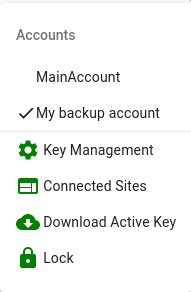
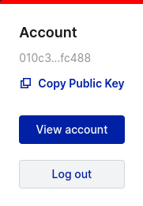

# Connect a Wallet

## What You'll Need

A compatible CSPR wallet: [CasperLabs's Signer](SignerGuide.md). More wallets, including Ledger, are planned for the future.

## Sign In

You can access the wallet Sign In screen by clicking `Sign In` from the top navigation menu of [CSPR.Live](https://cspr.live). Then follow these steps to sign in using the Signer app:

1. From the Sign In screen, click `Sign In` under the Casper Signer option.

    

2. The Signer app window will open automatically. From the Signer window, when prompted to connect Signer to site, click `Connect`.

    

3. Then click `Connect` again to approve the connection.

    

4. Now, you can change the connected account by using the hamburger menu of the Signer app if you like. Notice that ✔️ indicates the active account.

    

## View Account Details

View your account details at any time by clicking your Public Key in the top navigation menu of [CSPR.Live](https://cspr.live), and clicking `View Account` from the expanded menu.

## What's Next?

Once your wallet is connected, you can access a range of capabilities in [CSPR.Live](https://cspr.live), including [delegating a CSPR stake](Delegating-CSPR-Stake.md) to earn rewards.

