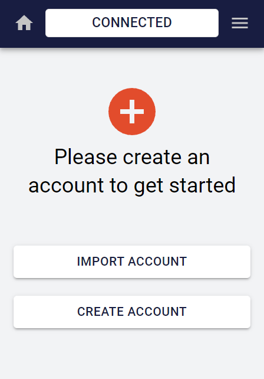
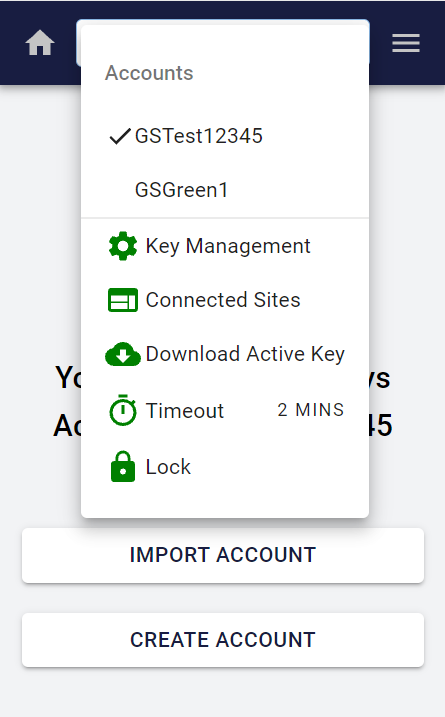
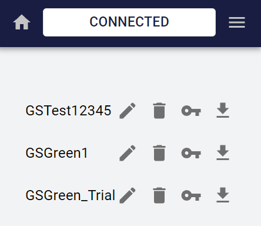
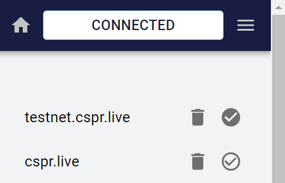
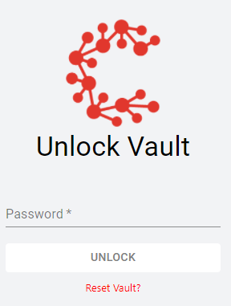

# Signer Guide

## Introduction

The Casper Signer allows users to safely access their Casper Tokens (CSPR) and transfer CSPR to another user, delegate stake, or undelegate stake. The Casper Signer can be used for more than one CSPR account, and all the accounts are securely stored in a vault, which is a mechanism to protect online information with a password. You set a password for the vault while creating a Casper Signer account. To log in using the Casper Signer, you must download and install the Casper Signer extension for your browser. The following sections take you through downloading and signing in to the Casper Signer using the [cspr.live](https://cspr.live/) block explorer. 

### Installing the Casper Signer Extension

To install the [Casper Signer](https://chrome.google.com/webstore/detail/casper-signer/djhndpllfiibmcdbnmaaahkhchcoijce) extension, follow these steps:

1. Navigate to [cspr.live](https://cspr.live/), using Chrome or a Chromium-based browser like Brave.
2. Click the **Sign in** option on the top-right corner of the screen. The Casper Signer is displayed.
3. Click the **Download Signer** button in the Casper Signer. A new window with the Chrome extension is displayed.
4. On the Casper Signer extension page, click the **Add to Chrome** button. A pop-up will let you know the permissions required. To approve the extension access, click **Add extension**. The Casper Signer extension is now added to your browser.

### Logging in to the Casper Signer

To log in to the Casper Signer, you must create a vault and import or create accounts. To create a vault, follow these steps:

1. Next to your browser's address bar, you will find the extensions icon. Click the extensions icon and select Casper Signer from the list.

    - If you are logging in for the first time, a pop-up window to create a new vault will appear.

    - On the New Vault pop-up window, enter a password for your vault, confirm the password, and click **CREATE VAULT**. This vault safeguards your Casper accounts, so make sure you use a strong password and keep the password safe.
    
    ```
        - Passwords must be at least 10 characters long 
        - Passwords must contain the following: 
            - at least one uppercase letter 
            - at least one lowercase letter 
            - at least one number 
            - at least one special character 
        - Passwords may not contain sequences of three or more repeated characters
    ```

2. If you have already created a password for your vault, the Unlock Vault pop-up window is displayed. Enter your password and click **UNLOCK**.
3. You can now import an account or create a new one.
    - If you have no cryptographic keys, you must create a new account. For more information on creating a new account, see [Creating an Account](#2-creating-an-account).
    - If you have a set of keys for your account, you can import the secret key into the Casper Signer. For more information on importing an existing account, see [Importing an Account](#3-importing-an-account).

<div align="center">

</div>

## Creating an Account

The Casper Signer allows you to create an account and generates a set of keys based on your chosen encryption algorithm. The Casper Network supports these two algorithms:

-   **Ed25519** is fast and provides a high level of security with foolproof session keys, among other features. It is the default algorithm used while creating new accounts.
-   **Secp256k1** is an efficient encryption algorithm used by Bitcoin and Ethereum. If you would like to derive Ethereum or Bitcoin keys using your private key in the future, then choose the Secp256k1 algorithm.

To learn more about cryptographic keys, see [Accounts and Cryptographic Keys](/dapp-dev-guide/keys.md).

To create an account, do the following:

1. On the Casper Signer home, click **CREATE ACCOUNT**. The Create Account fields are displayed.
2. Enter a name for the account and select the algorithm to generate the keys. The Public Key field is auto-populated.
3. Click **CREATE** to create your account.
    
> **Note:** It is highly recommended that you download and save your account keys in a safe location (preferably offline). This will allow you to recover your account if you lose access to the vault. See [Download Active Key](#44-download-active-key) for more information.

To return to the Casper Signer home, click the home icon on the top-left corner of the pop-up window. Here, you can see the number of accounts in your wallet and the name of the currently active account.


## Importing an Account

The Casper Signer allows you to add your existing keys to the Signer wallet. You must have the secret key for the account you wish to import. To import an account, do the following:

1. On the Casper Signer home, click **IMPORT ACCOUNT**. The Import from Secret Key File option is displayed.
2. Click **UPLOAD**, browse, and select the secret key you wish to add to your wallet.
3. Enter a name for the imported account and click **IMPORT**. Your secret key is now imported into the Casper Signer.

To return to the Casper Signer home, click the home icon on the top-left corner of the pop-up window. Here, you can see the number of accounts in your wallet and the name of the currently active account.

## Managing an Account

The main menu of the Casper Signer allows you to perform various functions, such as switching between accounts, managing keys, viewing connected sites, downloading keys, setting the timeout for your Signer session, and locking your vault. The main menu icon is located at the top-right corner of the Casper Signer window.

<div align="center">

</div>

### Switching Accounts

The main menu displays the names of all the accounts registered with the Casper Signer wallet. To select an account as the currently active account, click the account name. A checkmark appears in front of the account name. This indicates that the account is active.

### Key Management

Key management allows you to manage the keys added to your Signer wallet. You can rename the account, delete a key, view the account information (public key hex and the account hash), and download the secret key for each account.

To view the various functions available, on the main menu, select **Key Management**. The list of keys available is displayed along with the icons to manage keys.

<div align="center">

</div>

-   To rename an account, click the edit icon next to the account name, enter the new name and click **UPDATE**.
-   To delete an account, click the delete icon next to the account name. A Remove Account notification pops up. To approve the deletion, enter the password to your vault and click **REMOVE**.
- Click the key-shaped icon to view the account information, such as the public key and the account hash.
-   To download a copy of the secret key, click the down-arrow icon. The secret key is downloaded to your computer.

### Connected Sites

This feature lets you view all the websites and decentralized applications (dApps) connected with the Casper Signer. You can disconnect or delete the websites from Casper Signer using the icons next to the name of each site.

#### Connecting to websites and dApps

You can use the Casper Signer to connect to various websites and dApps. To connect to a website or dApp, do the following:

1. Navigate to the website or dApp integrated with the Signer.
2. Log in to your Signer; for more details, see [Logging in to the Casper Signer](#12-logging-in-to-the-casper-signer).
3. On the Signer home, the top bar displays DISCONNECTED. Click this bar to connect to the website. When the website is connected to the Casper Signer, the top bar displays CONNECTED.
4. Click the main menu icon to open the main menu and select **Connected Sites**. The current website is displayed in the list of connected sites.
5. To connect to a site, click the connect icon next to the name of the website.

<div align="center">

</div>

> **Note:** If the website is not integrated with Casper Signer, the roll-over text displays the message ‘This site is not integrated with the Signer’.

### Download Active Key

This feature allows you to download the secret key from your active account. To download the secret key for the selected active account, click the main menu icon and select **Download Active Key**.

### Timeout

This feature allows you to set the idle time limit for the Signer vault to lock itself automatically. Once the vault is locked, you must enter your password again to unlock the vault.

### Lock

This feature allows you to lock the vault. You must enter your vault password again to unlock the vault.

<div align="center">

</div>

## Resetting the Vault

Once you have created a password for the vault, every time you access it, you will see a **Reset Vault?** link below the UNLOCK button. You can click this link to delete all your CSPR accounts from the vault. If you have downloaded your account keys, you can create a new vault password and import the keys to your account and recover all the transactions.

## Viewing Account Details

You can view your account details, such as the public key, account hash, CSPR token balance, and transaction history.

To view your account information, do the following:

1. On the CSPR home page, click the option in the top-right corner of the screen that displays a few digits of your public key. A menu with your public key is displayed.
2. To view your account details for the displayed public key, click **View Account**.

## Accessing the CSPR Wallet from a Block Explorer

Once you are logged in to the Casper Signer, you can access the wallet for each account registered in the Signer. For more information on how to log in to the Signer, see [Logging in to the Casper Signer](#12-logging-in-to-the-casper-signer).

Alternatively, you can follow these steps to log in to your Signer/CSPR wallet:

1. Navigate to [cspr.live](https://cspr.live/), using Chrome or a Chromium-based browser like Brave.
2. Click the **Sign in** option on the top-right corner of the screen. The Casper Signer is displayed.
3. Click the **Sign In** button in the Casper Signer. The Unlock Vault pop-up is displayed.
4. Enter your password and click **UNLOCK**. The Connection Request message is displayed.
5. To continue with the connection, click **CONNECT**. The Approve Connection message appears.
6. To approve the connection, click **CONNECT**. You are now connected to your CSPR wallet.

## Logging out of the Casper Signer

To logout from the Signer, do the following:

1. On the CSPR home page, click the option in the top-right corner of the screen that displays a few digits of your public key. A menu with your public key is displayed.
2. Click **Logout**. You will be logged out of your vault.

## What's Next?

Once you have a Signer account, you can [connect it to CSPR.Live](Connect-a-Wallet.md) to access a range of capabilities, like viewing your account balance and [delegating CSPR stake](Delegating-CSPR-Stake.md) for rewards.
